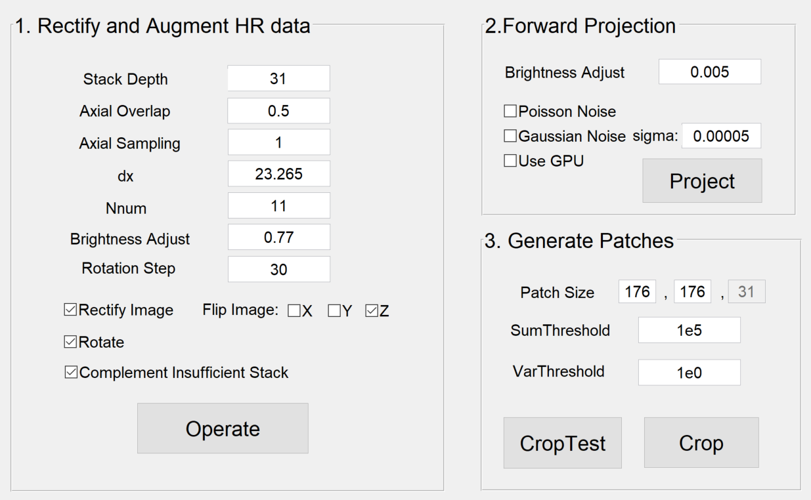

This package is used to generate training dataset for vcd-net, in the form of paired 2D light-field raw data and 3D ground truth. 
It's written in Matlab and we provide a GUI for convenience. The tool consists of 3 steps:

#### 1. Rectify and Augment HR data
Prepare the high resolution 3D stacks (Ground Truth) for Forward Projection (light field simulation). Each stack is cropped into substacks with certain number of slice, in corresponding to the depth of light field PSF (point spread function).
* **Parameters**
	* **Stack Depth**: [ int ] Slice number of each substacks. 
	* **Axial Overlap**: [ 0 ~ 1, double ] Overlap ratio (axially) for each adjacent substacks. e.g. if you set 0.5, then each adjacent substack would have half of the slices overlapped.
	* **Axial Sampling**: [>=1, int] The sampling rate (axially) for each stack. The program will take the slices with index 1 : **Axial Sampling** : end. 
	* **dx**: [ double ] The number of pixels behind a lenslet. e.g. you have a MLA with each lenslet as 150um in diameter and a sCMOS with pixel size as 6.5um, then you should have 150/6.5 = 23.08 pixels behind each lenslet.
	* **Nnum**: [ int ] The number of virtual pixel you expect to have behing a lenslet. e.g. you may have dx as 23, but you think it’s enough 
	or it’s required only to have 11 pixels for each lenslet, so you could set Nnum as 11. [This is a re-sampling procedure and it changes the pixel size of the output.]
	* **Brightness Adjust**: [ 0 ~ 1, double] An adjustable parameter for dynamic range. The higher it is, the higher the intensity of output image will be.
	* **Rotation Step**: [0~180, int] The rotating step size for each rotation.
	* **Rectify Image**: Enable to rectify each stack according to **dx** and **Nnum**. 
	* **Rotate**: Enable to rotate the stack for data augmentation.
	* **Complement Insufficient Stack**: Enable to add blank slices for those stack with fewer number of slices than **Stack Depth**.
	* **Flip Image**: Enable to flip stacks in certain dimension for data augmentation.  
	
* **Usage**: Set the above parameters and click **Operate**. A file selecting window will pop up, in which you could (multi-)select those HR stacks you want to input. A saving directory for output will automatically be created as ./Data/Substacks in this program’s directory.

#### 2. Forward Projection
Transform the substacks (generated in Step 1) into synthetic 2D light-field raw images.
* **Parameters**
	* **Brightness Adjust**: [ 0 ~ 1, double] An adjustable parameter for dynamic range. The higher it is, the higher the intensity of output image will be.
	* **Poisson Noise**: Enable to add poisson noise.
	* **Gaussian Noise**: Enable to add gaussian noise (it will be added after poisson noise if **Poisson Noise** is also enabled). Specify the standard deviation of the noise in the following textbox.
	* **Use GPU**: Enable to use GPU for processing.

* **Usage**: Set the above parameters click **Project**. Then you need to choose one PSF file from the popped up window. The program will read images from ./Data/Substacks and a folder ./Data/LFforward will be created to store the outputs.

#### 3. Generate Patches
Generate small patches (3D substacks v.s. 2D light field images) for VCD-Net training.
* **Parameters**
	* **Patch Size**: The size of the patches. 
	* **SumThreshold, VarThreshold**: 2 threshold values for program to decide which of those generated blocks are lack of information and should be discarded. 

* **Usage**: Input proper Patch Size and click *CropTest*. The program will then run a ‘test crop’ on some of the data and output their Sum and Var values. Then you could examine the output patches to decide threshold should to put. Input these threshold and click Crop. The program will read images from ./Data/Substacks and ./Data/LFforward and a folder .Data/TrainingPair will be created to store the outputs. 
